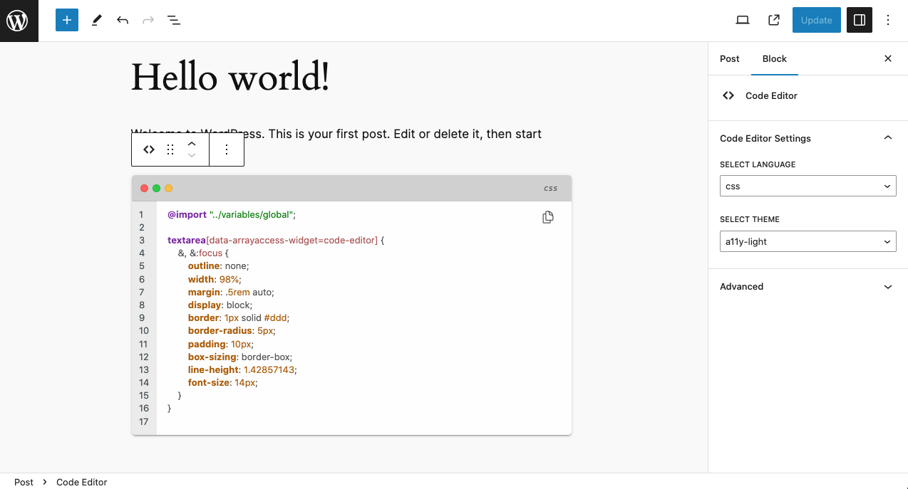

## WP Core Library

This is a library for WordPress development based on Object-Oriented code.
It provides a set of useful functions and classes.

The library is designed to be used with [Composer](https://getcomposer.org/). It is not a plugin itself, but a set of classes and functions that can be used in plugins or themes.


### Installation

Add the following to your `composer.json` file:

```json
{
    "require": {
        "arrayaccess/wp-core-library": "dev-master"
    }
}
```


### Usage

To use the library, you need to include the Composer autoloader in your plugin:

```php
require_once __DIR__ . '/vendor/autoload.php';
```


### Requirements

- php >= 8.0
- composer >= 2.0
- WordPress >= 6.4


## Features

- Fully Object-Oriented Library & Codes.
- PSR2 Coding Standard
- Service-based library architecture
- Object-Oriented WordPress Hooks.
- Object-Oriented WordPress Rest API.
- Object-Oriented WordPress Admin Pages.
- Object-Oriented WordPress Admin Ajax.
- Object-Oriented WordPress Block Registration Hooks.
- Object-Oriented Form Fields & Builder
- Database abstraction layer using doctrine/dbal with WordPress caching implementation
- Database schema comparison using doctrine/dbal
- Object-based WordPress options
- Stateless Hash Generator, better for stateless API authentication
- Code Editor Using [CodeJar](https://medv.io/codejar/) & [Highlight.js](https://highlightjs.org/) (Fullscreen mode, collapsed, line numbers, syntax highlighting, etc.)
- WP Blocks Widget (Gutenberg)





## Utilities

- Consolidator: Consolidate various helpers at once.
- Filter: Filtering & validate the data.
- HTML Attribute Generator: Easier to generate HTML attributes.
- IP Helper: Validate & Generate IP Address.
- UUID Helper: Generate, validate & parse UUID from version 1 to 5. (RFC 4122)
- Global Variable Helper: Various helpers to safely call & validate global predefined variables. ($_POST, $_GET, $_SERVER, $_COOKIE, $_ENV, $_FILES, $_REQUEST, $_SESSION)
- Form Builder: Build form using object-oriented code.
- And many more...


## Documentation

**Under construction.**

> Consider there are people to help me write the documentation; I will focus on the code first.

## Contributing

Contributions are welcome from everyone.

Refer to [CONTRIBUTING.md](CONTRIBUTING.md) for information on how to contribute to this project. 

## License

GPLv3 or later see [LICENSE](LICENSE).
